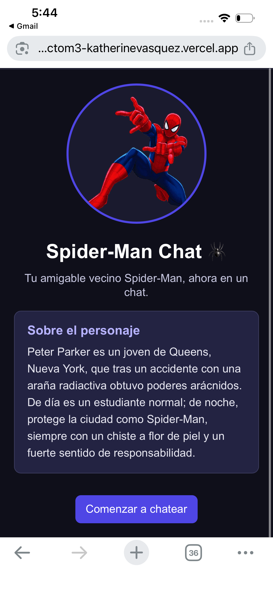
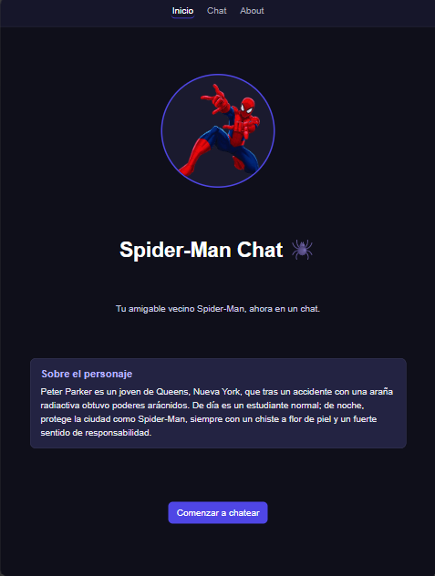
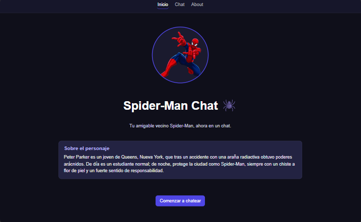
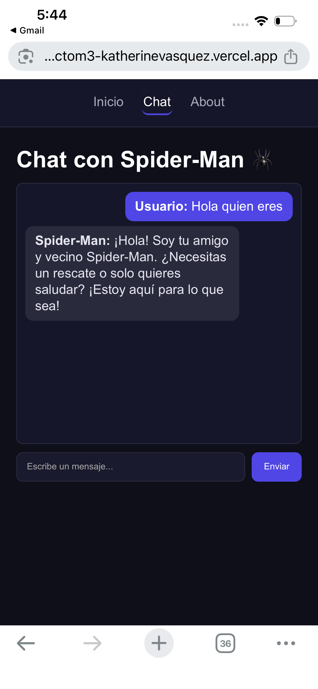
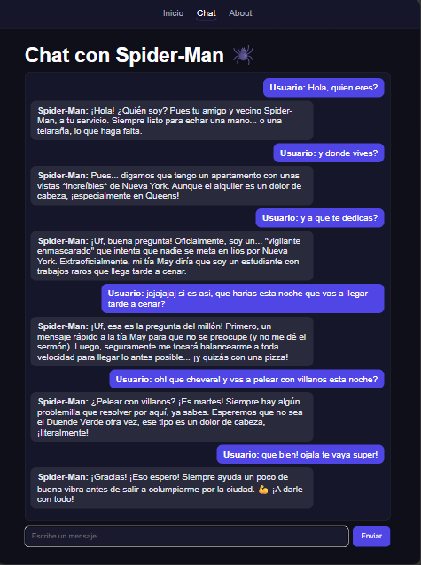
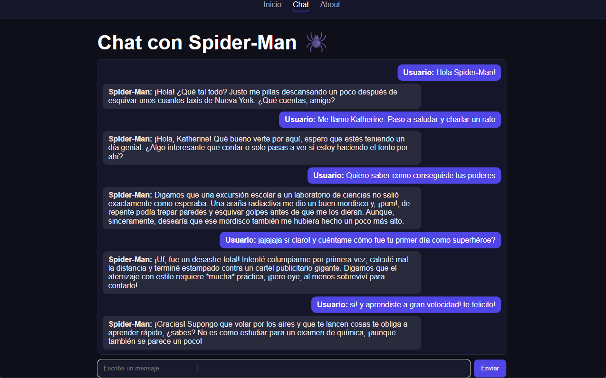
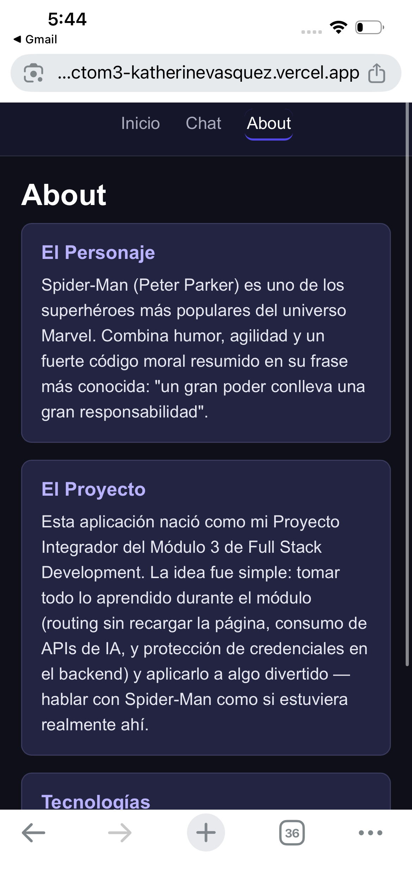
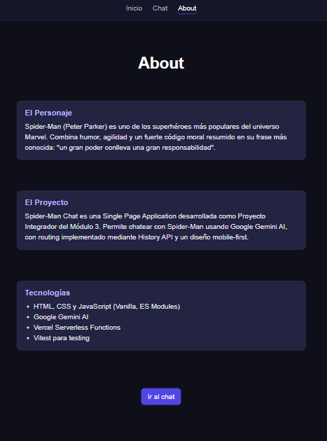
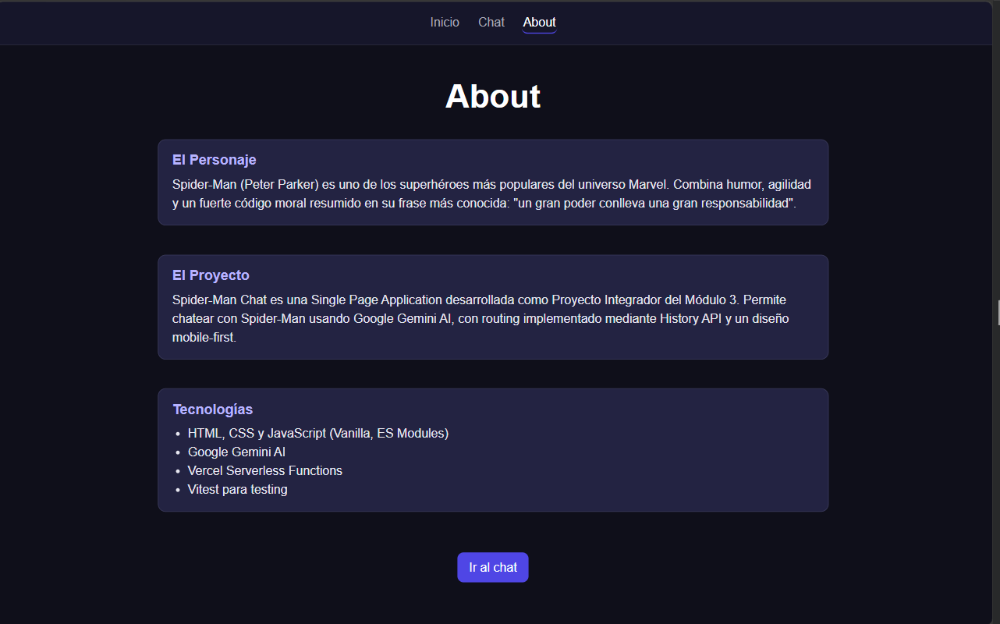

# Spider-Man Chat 🕷️

Single Page Application que permite chatear con **Spider-Man (Peter Parker)** usando
Google Gemini AI, con la API key protegida mediante una Vercel Serverless Function.

> Proyecto Integrador del Módulo 3 — Full Stack Development.

## Personaje elegido

**Spider-Man / Peter Parker.** Se eligió por ser un personaje muy reconocible, con una
personalidad distintiva (ingenioso, bromista, pero responsable) que se presta bien para
un chat dinámico y entretenido. El system prompt completo que define su personalidad
está en [`src/chat.js`](./src/chat.js): define su rol, tono, límites, y lo mantiene
resistente a peticiones que intenten sacarlo de personaje (por ejemplo, pedirle que
resuelva ejercicios de programación).

## Demo

- **URL desplegada:** https://proyectom3-katherinevasquez.vercel.app
- **Repositorio de GitHub:** https://github.com/katherine-vasquez/proyectom3_katherinevasquez

### Capturas de pantalla

| | Mobile | Tablet | Desktop |
|---|---|---|---|
| **Home** |  |  |  |
| **Chat** |  |  |  |
| **About** |  |  |  |

## Stack técnico

- HTML / CSS (mobile-first) / JavaScript (Vanilla, ES Modules)
- Google Gemini AI (`@google/generative-ai`), con fallback automático entre 3 modelos
  (`gemini-2.5-flash` → `gemini-2.5-flash-lite` → `gemini-3.5-flash`)
- Vercel Serverless Functions (proxy seguro hacia Gemini)
- Vitest (testing unitario)
- History API (routing SPA sin recarga de página)

## Estructura del proyecto

````← ESTA LÍNEA NUEVA (apertura)

proyectom3_katherinevasquez/
├── api/
│   └── functions.js       # Serverless Function: proxy seguro hacia Gemini
├── public/
│   ├── index.html
│   ├── styles.css          # Mobile-first + media queries (tablet/desktop)
│   ├── app.js               # Routing SPA, render de vistas y lógica de chat
│   ├── utils.js             # Funciones compartidas navegador + servidor
│   └── assets/
│       └── spiderman.png    # Imagen del personaje (vista Home)
├── src/
│   ├── chat.js               # Nombre del personaje + system prompt (solo servidor)
│   └── models.js             # Lista de modelos y detección de errores transitorios
├── tests/
│   ├── utils.test.js
│   ├── app.test.js
│   └── models.test.js
├── screenshots/               # Capturas para este README
├── .env.example
├── vercel.json
├── vitest.config.js
└── package.json
```  
> Nota sobre la estructura: `index.html`, `styles.css`, `app.js` y `utils.js` viven en
> `public/` porque es la carpeta que Vercel publica al navegador. `src/chat.js` y
> `src/models.js` quedan afuera porque solo los usa la Serverless Function — el
> navegador nunca necesita verlos.

## Requisitos

- Node.js 18+
- Cuenta de Vercel y Vercel CLI (`npm i -g vercel`, o usar `npx vercel`)
- Una API key de Google Gemini: https://aistudio.google.com/app/apikey

## Instalación y ejecución local

1. Clonar el repositorio y entrar a la carpeta:
```bash
   git clone https://github.com/katherine-vasquez/proyectom3_katherinevasquez.git
   cd proyectom3_katherinevasquez
```

2. Instalar dependencias:
```bash
   npm install
```

3. Configurar las variables de entorno: copiar `.env.example` a `.env` y pegar tu API
   key real:
```bash
   cp .env.example .env
```
GEMINI_API_KEY=tu_api_key_aquí
   El archivo `.env` **no se sube al repositorio** (está en `.gitignore`).

4. Levantar el proyecto en local con Vercel CLI (necesario para que la serverless
   function funcione igual que en producción):
```bash
   npx vercel dev
```

5. Abrir `http://localhost:3000` en el navegador.

## Cómo ejecutar los tests

```bash
npm test
```

Esto corre 19 tests unitarios con Vitest: transformación de mensajes, parseo de la
respuesta de la API con `fetch` mockeado, resolución de rutas del router SPA, y la
lógica de detección de errores transitorios (429/503) para el fallback entre modelos.

## Cómo desplegar a Vercel

1. Conectar el repositorio de GitHub en https://vercel.com/new.
2. En **Project Settings → Environment Variables**, agregar:
   - `GEMINI_API_KEY` = tu API key real (en Production, Preview y Development).
3. Desplegar:
```bash
   npx vercel --prod --force
```
4. Si algo no funciona en producción, revisar en el dashboard de Vercel:
   **Functions → Runtime Logs**, ahí aparece el error real de la serverless function.

## Funcionalidad implementada

- Routing SPA (`/home`, `/chat`, `/about`) con History API: enlaces `<a>` reales,
  intercepción selectiva de clicks, manejo de `popstate`, vista 404 para rutas
  desconocidas, barra de navegación fija que resalta la vista activa, y soporte de
  los botones back/forward del navegador.
- Diseño mobile-first con media queries para tablet (768px) y desktop (1024px). En
  pantallas grandes, Home/About centran su contenido verticalmente y la caja de
  mensajes del chat crece para llenar el espacio disponible.
- Chat con diferenciación visual entre mensajes del usuario y de Spider-Man, indicador
  de "escribiendo...", scroll automático, y bloqueo del input/botón mientras se espera
  respuesta (evita disparar el límite de peticiones por enviar mensajes muy rápido).
- El historial completo de la conversación se envía en cada request a Gemini (vía
  `model.startChat`), para que el personaje mantenga contexto durante la sesión.
- **Fallback automático entre modelos**: si `gemini-2.5-flash` está saturado (429) o el
  servicio no está disponible (503), la Serverless Function reintenta automáticamente
  con `gemini-2.5-flash-lite` y luego con `gemini-3.5-flash`, dentro de la misma
  solicitud. Si los 3 fallan, se muestra un contador visual en el chat indicando
  cuánto esperar antes de reintentar.
- La API key de Gemini nunca se expone en el frontend: toda llamada a Gemini pasa por
  la Serverless Function en `/api/functions`, que valida método HTTP y body antes de
  procesar.
- El system prompt incluye instrucciones explícitas para que el personaje no rompa su
  rol ante intentos de "prompt injection" (pedirle código, ignorar instrucciones, etc.).

## Registro de uso de IA en el proyecto

Se utilizó Claude (Anthropic) como asistente durante el desarrollo para:

- Diseñar y redactar el system prompt que define la personalidad de Spider-Man en
  `src/chat.js`, siguiendo el checklist de la clase FSM3L6 (rol, tono, límites,
  longitud de respuesta), y reforzarlo contra peticiones fuera de personaje.
- Diagnosticar y corregir el fallo original del despliegue en producción: el modelo
  `gemini-1.5-flash` usado al inicio fue retirado por Google, lo que causaba que toda
  llamada a la API devolviera error 404.
- Implementar un sistema de fallback entre 3 modelos de Gemini (siguiendo la estrategia
  explicada en clase), incluyendo el manejo diferenciado de errores 429 (cuota
  agotada) y 503 (servicio saturado), y ajustar `maxOutputTokens` para modelos que
  usan razonamiento interno antes de responder.
- Implementar el bloqueo de la interfaz mientras se espera respuesta y un contador
  visual para cuando se agota la cuota de todos los modelos disponibles.
- Revisar el proyecto completo contra la rúbrica de calificación y las 8 clases del
  módulo, corrigiendo brechas como: falta de envío de historial de conversación a
  Gemini, incompatibilidad entre ES Modules y la configuración del `package.json`,
  ausencia de `vercel.json`, código compartido ubicado fuera de la carpeta pública
  (rompiendo el import en el navegador), configuración rota de Vitest, y
  documentación incompleta.
- Ajustar el diseño responsive de tablet/desktop para distribuir el espacio de forma
  pareja en pantallas grandes, en vez de dejar el contenido pegado arriba.
- Ampliar la suite de tests de 4 a 19, agregando mocking real de `fetch` sobre
  funciones exportadas (evitando el antipatrón de "test circular").

## Mejoras futuras (extra credit no implementado)

- Persistencia del historial con `localStorage`.
- Galería de selección de múltiples personajes.
- Modo oscuro/claro con toggle.

---

**Autor:** Katherine Vásquez